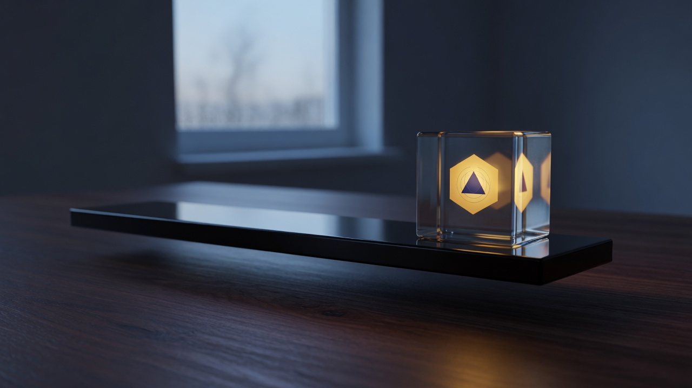

# AppImages



Omarchy plugin that installs AppImages into the launcher: drop a file on the bar icon, pick one with Add, or use the CLI. It writes a normal XDG `.desktop` file, so Super+Space finds the app like anything else.

Plugin id: `07dcolem.appimages`

Not Flatpak. Not a Gear Lever clone. v0.1 does not check for updates.

## Install

```bash
omarchy plugin add https://github.com/07dcolem/omarchy-appimages.git --enable --yes
omarchy bar put 07dcolem.appimages
```

The widget lands on the right side of the bar. If the icon is missing:

```bash
omarchy restart shell
omarchy plugin list
```

Do not symlink a checkout into `~/.config/omarchy/plugins/`. Omarchy rejects plugin trees that contain symlinks. For local development, copy the files — see [CONTRIBUTING.md](CONTRIBUTING.md).

## Remove

```bash
omarchy plugin remove 07dcolem.appimages
```

That unloads the plugin and removes `~/.config/omarchy/plugins/07dcolem.appimages/`. An install from `omarchy plugin add` is deleted. A plain copy, with no `.git` directory, is moved aside to a hidden backup in that same plugins folder.

AppImages already in `~/Applications`, their icons, and their `.desktop` launchers stay. Those launchers run this plugin's `omarchy-launch-appimage`, so remove each app from the panel first if you want it gone. Putting the plugin back makes the existing launchers work again.

## Usage

- Hover the bar icon for the name. The icon is a drop target.
- Hold an `.AppImage` on the icon to open the panel, or drop it on the panel, or click Add.
- Confirm shows the filename, destination `~/Applications/<name>.AppImage`, and a SHA-256 when hashing finishes.
- Install **moves** the file. It does not copy it.
- Each row: open, or remove (launcher + icon + payload). Keep file drops the launcher and icon only.
- Esc closes the panel. Enter launches a row, or confirms install.

## CLI

Scripts live in the installed plugin. They stay non-interactive when you pass a path or name.

```bash
PLUGIN=~/.config/omarchy/plugins/07dcolem.appimages

"$PLUGIN/bin/omarchy-appimage-install" ~/Downloads/Example.AppImage
"$PLUGIN/bin/omarchy-appimage-list"
"$PLUGIN/bin/omarchy-appimage-remove" Example
```

- `--replace` on install overwrites a launcher that already uses that name.
- `--keep-file` on remove leaves the payload in `~/Applications`.

## Scope

v0.1: install, list, open, remove.

Not in this release: update checks, GitHub/GitLab sources, side-by-side versions, background fetch, notifications.

## Dependencies

Most AppImages are type-2 and need `libfuse.so.2`:

```bash
omarchy pkg add fuse2
```

`fuse3` only gives `fusermount3`. Metadata extraction uses the bundle's `--appimage-extract`, which also wants `libfuse.so.2`. Optional, for inspecting a squashfs by hand:

```bash
omarchy pkg add squashfs-tools
```

A launcher can still be written without FUSE. Starting the app may then fail; the panel warns once.

## License

MIT. See [LICENSE](LICENSE).

## Attribution

Install, launch, and remove logic in bin/ is adapted from
https://github.com/kabe2007/omarchy-appimage-integration
by Juan I. de Elizalde (GitHub: kabe2007), licensed under the MIT License.

Copyright (c) 2026 Juan I. de Elizalde
Copyright (c) 2026 07dcolem

This plugin is not affiliated with or endorsed by Juan I. de Elizalde.
The MIT license text is in LICENSE. That notice and the copyright lines
above must be preserved in copies and substantial portions of this software.
